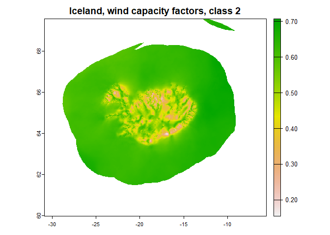

<!-- README.md is generated from README.Rmd. Please edit that file -->

# globalwindatlas

<!-- badges: start -->

[](https://lifecycle.r-lib.org/articles/stages.html#experimental)
[](https://CRAN.R-project.org/package=globalwindatlas)

<!-- badges: end -->

The package assists downloading and processing high-resolution (250m
grid) maps with averaged wind potential from [Global Wind
Atlas](https://globalwindatlas.info). The data might be useful in energy
systems modeling for selections of locations with high wind energy
potential.

Documentation: <https://energyrt.github.io/globalwindatlas/index.html>

## Installation

You can install the development version of globalwindatlas from
[GitHub](https://github.com/) with:

``` r
# install.packages("devtools")
devtools::install_github("energyRt/globalwindatlas")
```

## Example

This is a basic example which shows you how to solve a common problem:

``` r
library(globalwindatlas)
## set directory for downloaded files, also will be used for quick files access
gwa_set_dir("data/gwa")
## download wind capacity factors for wind-class #1
gwa_get_wind_cf("ISL", IEC = 1)
#> [1] "data/gwa/ISL_capacity_factor_IEC1.tif"
## download wind speed data
ISL <- gwa_get_wind_cf("ISL", IEC = 2) # Iceland
ISL
#> [1] "data/gwa/ISL_capacity_factor_IEC2.tif"

MAR <- gwa_get_wind_speed("MAR", height = 150) # Morocco

## plot data
library(terra)
#> terra 1.7.29
plot(rast(MAR), main = "Morocco, wind speed at 150m height, m/s")
```


``` r
plot(rast(ISL), main = "Iceland, wind capacity factors, class 2")
```



## References

<https://globalwindatlas.info/download/gis-files> (files to download)

<https://energyrt.github.io/globalwindatlas/index.html> (documentation)
